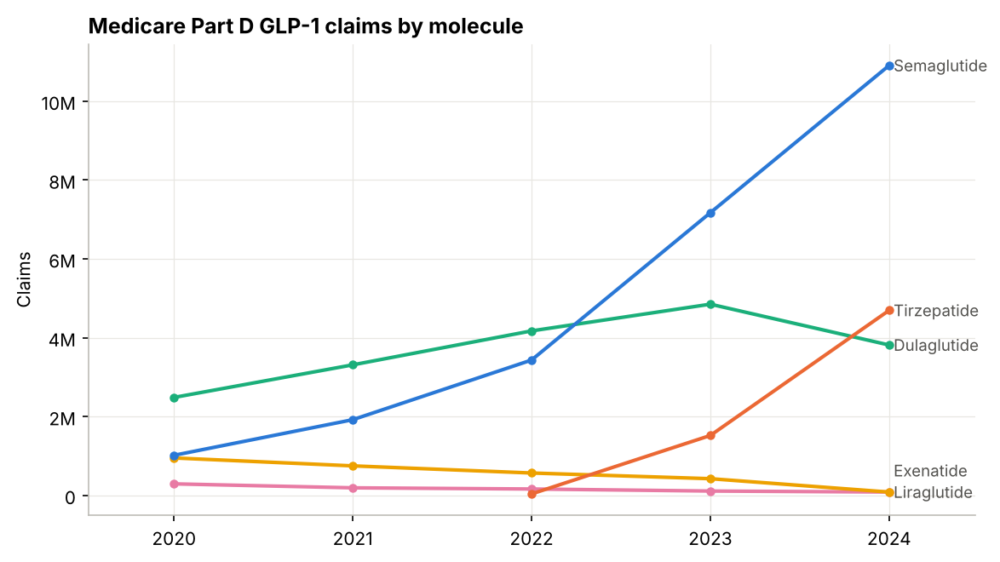
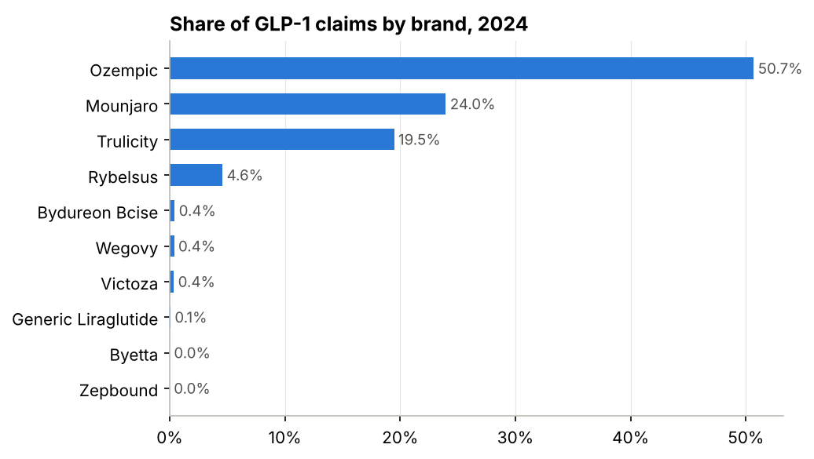
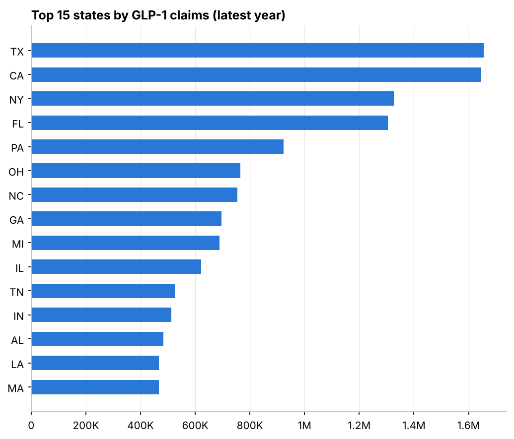
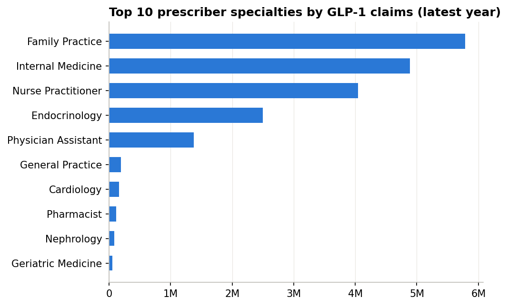
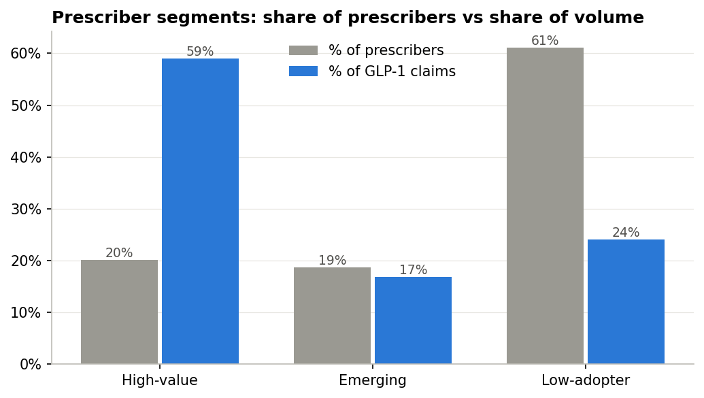
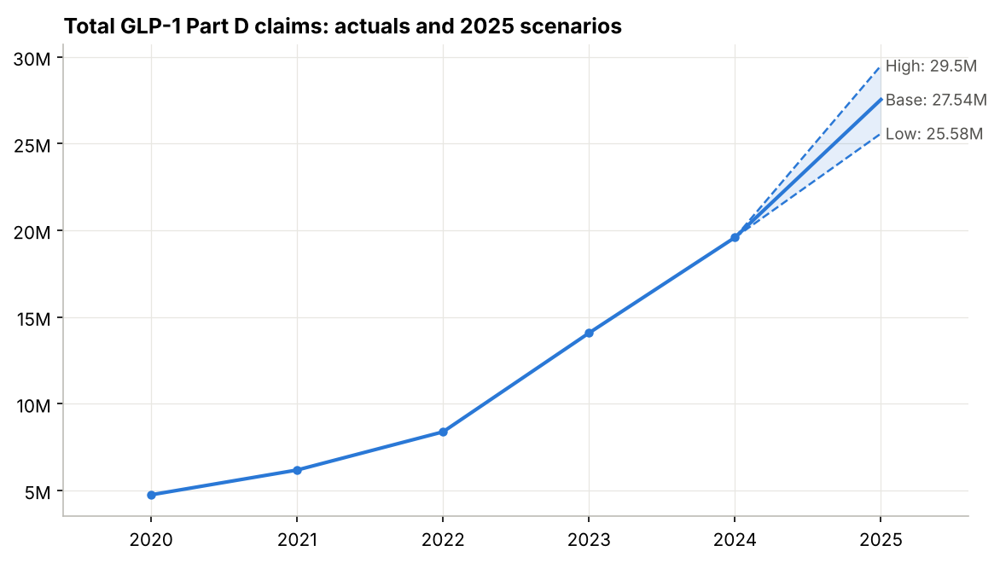
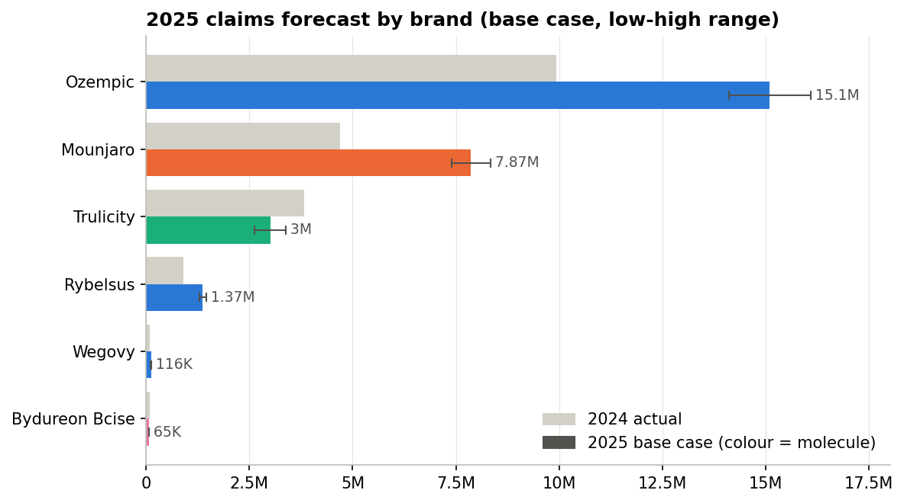

# US GLP-1 Market Opportunity & Prescriber Analytics

A pharma consulting-style analysis of the US GLP-1 market (semaglutide, tirzepatide, dulaglutide,
liraglutide, exenatide) built on public **CMS Medicare Part D Prescribers by Provider and Drug** data.

**Business question:** where should a GLP-1 brand team focus its sales force next year?

## What it answers
1. **Market sizing:** how big is the Part D GLP-1 market, which brands lead, and which states and specialties hold the volume?
2. **Prescriber segmentation:** which prescribers are high-value, emerging or low-adopters?
3. **Forecast:** how many claims next year, by molecule and by brand, under base, high and low scenarios?
4. **Recommendation:** a one-page memo for the brand team (`docs/memo.md`) and a Tableau Public dashboard.

## Key results (CMS data years 2020 to 2024)
- **Market:** 19.6M GLP-1 Part D claims and $24.6B gross drug cost in 2024 (+39% claims YoY, 4.1x 2020).
- **Brands:** Ozempic 51% of claims, Mounjaro 24% (+209% YoY), Trulicity 19% (-21%).
- **Concentration:** the top 20% of prescribers write 59% of claims; primary care (FP, IM, NP, PA) writes 82%.
- **2025 forecast:** 27.5M claims base case (25.6M low, 29.5M high). By brand: Ozempic 15.1M, Mounjaro 7.9M (24% to 29% of claims), Trulicity 3.0M.
- **Recommendation:** see the brand-team memo, [`docs/memo.md`](docs/memo.md).

## Charts
| | |
|---|---|
|  |  |
|  |  |
|  |  |
|  | |

## Data source
[Medicare Part D Prescribers - by Provider and Drug](https://data.cms.gov/provider-summary-by-type-of-service/medicare-part-d-prescribers/medicare-part-d-prescribers-by-provider-and-drug),
published by the Centers for Medicare & Medicaid Services (CMS), data years 2020 to 2024.
data.cms.gov is not reachable from some countries (for example India); if the link does not open, see the
[archived copy of the dataset page](https://web.archive.org/web/20260716135114/https://data.cms.gov/provider-summary-by-type-of-service/medicare-part-d-prescribers/medicare-part-d-prescribers-by-provider-and-drug).
The download step finds each year's dataset through the CMS catalog (`data.cms.gov/data.json`) and keeps only GLP-1 rows.
Raw and processed data are not committed (they are large); `python run_all.py` recreates them.

**Can't reach data.cms.gov?** A copy of the exact GLP-1 rows used here (2020 to 2024, 40 MB zip) is attached to the
[`data-v1` release](https://github.com/wreckVarun/glp1-market-prescriber-analytics/releases/tag/data-v1).
`python run_all.py --mirror` downloads it for you, and the download step also switches to it automatically if CMS is unreachable.

## Project structure
```
glp1-market-prescriber-analytics/
├── run_all.py              # runs the full pipeline in order
├── requirements.txt
├── src/
│   ├── config.py           # molecules, brands, thresholds, paths
│   ├── 00_make_sample_data.py
│   ├── 01_download.py ... 07_tableau_extracts.py
├── data/                   # created by the pipeline (git-ignored)
│   ├── raw/
│   └── processed/
├── outputs/
│   ├── tables/             # analysis tables (CSV)
│   ├── charts/             # PNG charts
│   └── tableau/            # dashboard-ready extracts + glp1_dashboard.twbx
└── docs/
    ├── memo.md             # one-page brand-team recommendation
    ├── methodology.md      # assumptions, choices and weaknesses
    └── tableau_guide.md    # step-by-step dashboard build
```

## Pipeline
| Step | Script | Output |
|---|---|---|
| 1 | `src/01_download.py` | GLP-1 rows per year pulled from the CMS Data API (`data/raw/`) |
| 2 | `src/02_clean.py` | one cleaned prescriber x brand x year panel |
| 3 | `src/03_market_sizing.py` | brand, molecule, state, specialty tables |
| 4 | `src/04_segmentation.py` | prescriber segments + segment summaries |
| 5 | `src/05_forecast.py` | next-year base / high / low forecast, by molecule and by brand |
| 6 | `src/06_charts.py` | Matplotlib charts (`outputs/charts/`) |
| 7 | `src/07_tableau_extracts.py` | dashboard-ready CSVs (`outputs/tableau/`) |
| 8 | `src/08_tableau_workbook.py` (optional) | packaged Tableau workbook `outputs/tableau/glp1_dashboard.twbx` |

All thresholds and assumptions live in `src/config.py`.

```bash
pip install -r requirements.txt
python run_all.py            # downloads real CMS data, then runs every step
python run_all.py --sample   # synthetic data with the CMS layout, for testing without internet
python run_all.py --mirror   # same real data from this repo's GitHub release (use where data.cms.gov is blocked, e.g. India)
python run_all.py --skip-download   # reuse CSVs already in data/raw/
```

## Methods (deliberately simple and explainable)
- **Sizing:** `groupby` sums of claims and gross drug cost.
- **Segmentation:** percentile tiers. High-value = top 20% by latest-year claims; Emerging = mid-volume (P50 to P80) and growing faster than the market, or new; Low-adopter = rest.
- **Forecast:** base case = the lower of 3-year CAGR and latest YoY per molecule (launch brand: repeat last absolute gain), +/- 10 points of growth for high/low, with a linear-trend cross-check. Brand forecast = molecule forecast x the brand's latest-year share of that molecule.

Full reasoning, assumptions and weaknesses: [`docs/methodology.md`](docs/methodology.md).

## Key caveats
- **Medicare only** (65+ and disabled); commercial patients are not included.
- **~2-year CMS lag:** the latest year is the newest CMS has published.
- **Rows with < 11 claims are suppressed** for privacy, so totals are slight undercounts.
- **Weight-loss-only use is not covered by Part D**, so Wegovy/Zepbound volume is small; this is mainly a type 2 diabetes view.
- **Drug cost is gross, before rebates.** It is not manufacturer revenue.
- **Mounjaro launched mid-2022**, so its trend rests on very few data points.

## Dashboard
[`outputs/tableau/glp1_dashboard.twbx`](outputs/tableau/glp1_dashboard.twbx) is a ready-to-open Tableau workbook (data included).
It opens on **GLP-1 Market Story**, where caption buttons switch between six views:

| Story button | What it shows | Interaction |
|---|---|---|
| Market sizing | KPI tiles (19.6M claims, $24.6B, +39%, 59%, 27.5M), brand trend, share, segments, forecast | hover for detail |
| By brand | claims by brand 2020-2024 and share of claims | pick a year |
| By state | US map and top 10 states, with the California gap | hover a state |
| By specialty & segment | high-value / emerging / low-adopter volume and top 10 specialties | hover for prescriber counts |
| Forecast by brand | 2025 base / high / low scenarios and base case by brand | tick brands |
| So what | memo recommendations next to a prescriber target list | segment, state and top-brand filters |

Rebuild it after rerunning the pipeline with `pip install tableauhyperapi` then `python src/08_tableau_workbook.py`.
Manual build guide: [`docs/tableau_guide.md`](docs/tableau_guide.md). Tableau Public link: _to be added_.

## Tools
Python (pandas, NumPy, Matplotlib), Tableau Public.

## Author
Varun Kumar ([@wreckVarun](https://github.com/wreckVarun))

## License
Code is released under the [MIT License](LICENSE). CMS data is public and subject to CMS terms of use.
